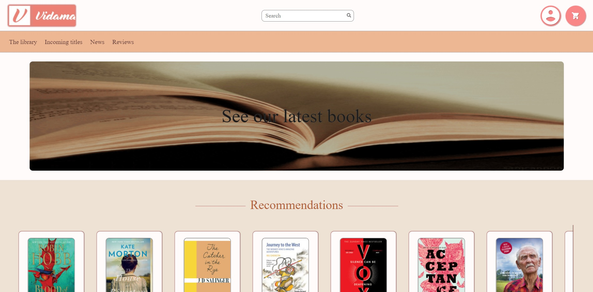
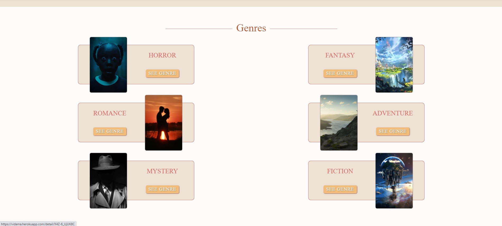
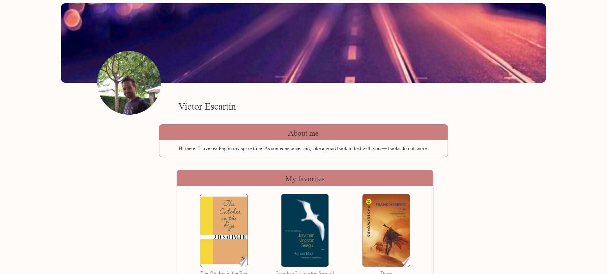
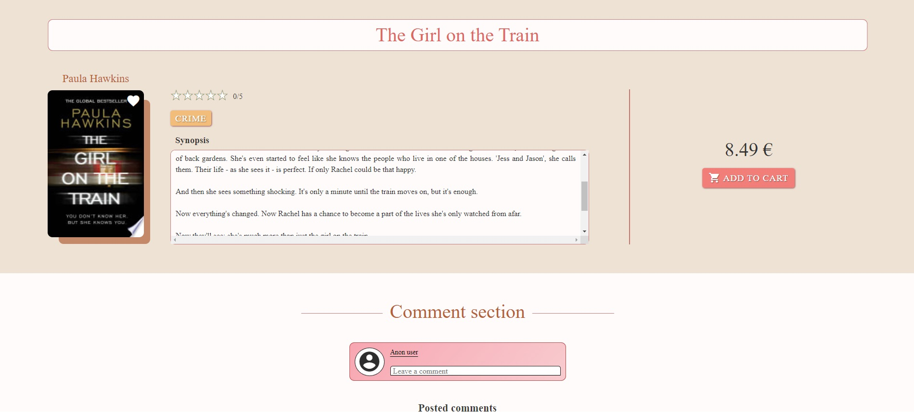

# VIDAMA-Skylab-frontend-TeamChallenge-REACT

---






## Table of Contents

1. [General Info](#general-info)
2. [Web Example](#web-example)
3. [Installation](#installation)

---

## 1. General Info

Frontend Team-working Challenge of Skylab Coders Academy bootcamp 10-2020,
making a -ecommerce library using Google Books API

This app has been created with React

## 2. Web Example

You can see the app working here :

- https://vidama.herokuapp.com/


## 3. Installation

A little intro about the installation:

```
$ git clone https://github.com/vescartinq/VIDAMA-skylab-challenge-REACT.git
$ npm install
$ npm start

```
